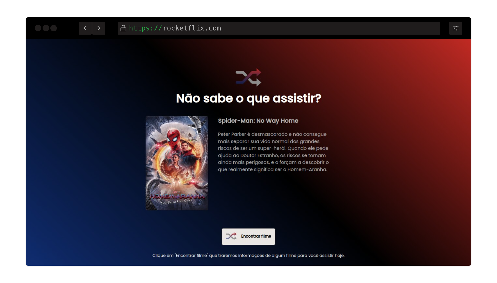

<h1 align="center"> RocketFlix </h1>

## 💻 **Projeto**

Neste desafio você deverá utilizar a API do [themoviedb.org](http://themoviedb.org/) para exibir um filme aleatório sempre que clicar em Encontrar Filme.

### Layout

## 🚀 **Techs**

- HTML
- CSS
- JavaScript

## ✅ **Requisitos**

Neste desafio você vai construir uma página que exiba aleatoriamente um filme para o usuário. Caso você ainda não tenha feito os cursos do Discover ou queira fazer uma revisão, segue abaixo uma lista dos cursos que podem te ajudar a resolver este desafio.

- [O Guia estelar de HTML](https://app.rocketseat.com.br/node/o-guia-estelar-de-html)
- [O Guia estelar de CSS](https://app.rocketseat.com.br/node/o-guia-estelar-de-css)
- [O Guia estelar de JavaScript](https://app.rocketseat.com.br/node/o-guia-estelar-de-java-script)
- [Posicionando Foguetes](https://app.rocketseat.com.br/node/posicionando-foguetes)
- [Pilotando com a DOM](https://app.rocketseat.com.br/node/pilotando-com-a-dom)

**Requisitos para o desafio:**

- Consumir a API do [https://www.themoviedb.org/](https://www.themoviedb.org/)
- Ter um botão que traga um filme aleatório com poster e descrição do filme.
- Se o filme não existir, apresente uma mensagem e imagem informando que o filme não está disponível.
